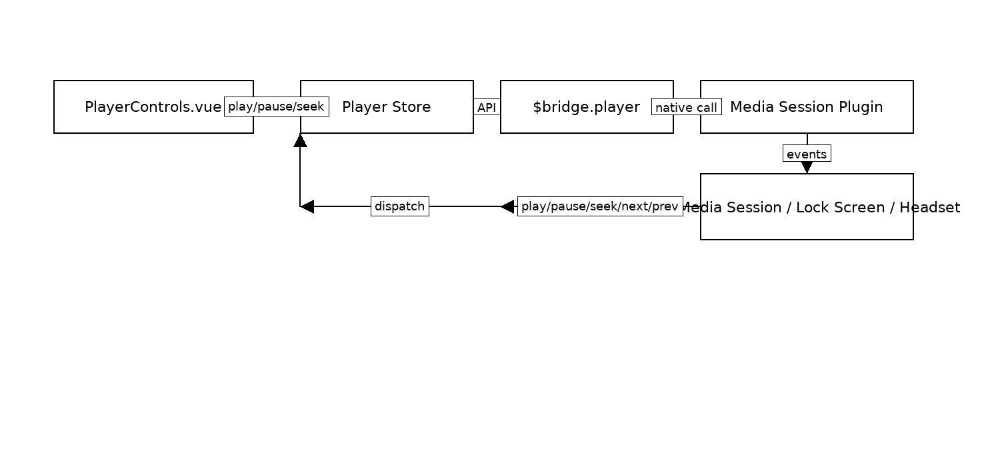
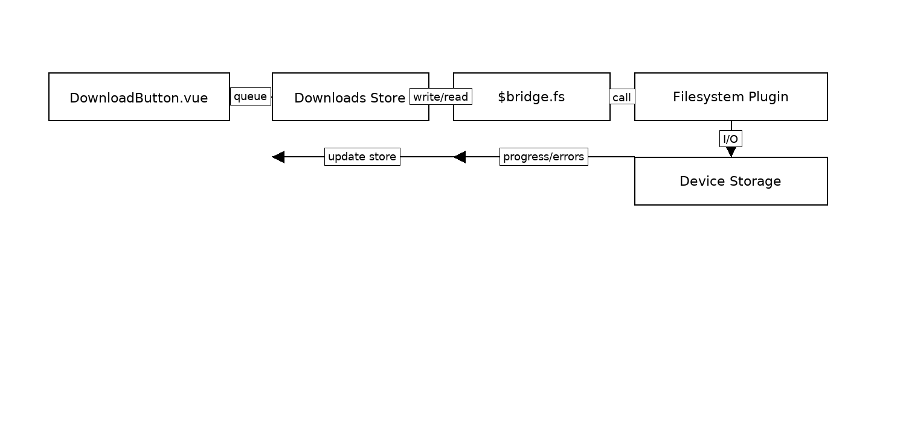
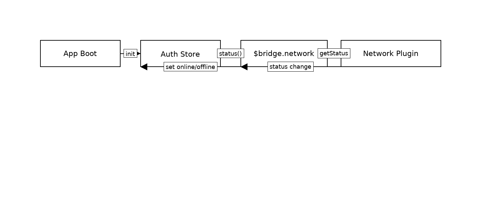

# Audiobookshelf Mobile — Detailed Architecture (with Diagrams)

> Repository: `advplyr/audiobookshelf-app`
> Stack: **Nuxt (Vue 3)** + **Capacitor** (Android/iOS shells).
> Purpose: Explain the code architecture, Vue↔Capacitor linkage, plugin APIs, and how to keep most logic in TypeScript while pushing minimal functionality to native.

---

## 1. Repository Layout

```
/android/                 # Native Android container (Kotlin, Gradle)
/ios/                     # Native iOS container (Swift, Xcode)
/assets/                  # Static assets (images, icons, themes)
/components/              # Vue reusable UI (buttons, cards, playback controls)
/composables/             # Vue 3 composables (hooks: API calls, playback, etc.)
/layouts/                 # Nuxt layouts for page shells
/middleware/              # Nuxt middleware (auth checks, redirects)
/pages/                   # Route → page components (library, player, settings)
/plugins/                 # Nuxt plugins (Capacitor bridge lives here)
/store/                   # Pinia stores (auth, player, library, downloads, settings)
/static/                  # Public static files served as-is
/docs/                    # Documentation (this file belongs here)
```

**Overview diagram**


---

## 2. Module Responsibilities

### UI (Vue Pages & Components)

- Pages correspond to routes (`/library`, `/book/:id`, `/player`).
- Components are reusable (player controls, seek bar, book list item).

### State (Pinia Stores)

- **Auth** → Server URL, tokens, refresh.
- **Library** → Book metadata, filters, pagination.
- **Player** → Playback state, queue, bookmarks, metadata updates.
- **Downloads** → Offline books, storage locations, progress.
- **Settings** → Theme, playback defaults, feature flags.

### Services

- **ApiClient** → Talks to Audiobookshelf server (REST + WebSocket).
- **Capacitor Bridge** → Encapsulates Capacitor plugins (Network, Filesystem, App lifecycle, Share, Media/Audio).

---

## 3. Vue ↔ Capacitor Linking

The app registers `/plugins/capacitor-bridge.client.ts` to inject `$bridge`. Stores/composables call `$bridge`; components never import Capacitor directly.

**Playback flow**


**Downloads flow**


**Connectivity flow**


---

## 4. Capacitor Plugin APIs (used/likely)

### Network (`@capacitor/network`)

- `getStatus()` → `{ connected, connectionType }`
- `addListener('networkStatusChange', cb)`

### Filesystem (`@capacitor/filesystem`)

- `writeFile({ path, data, directory })`
- `readFile({ path, directory })`
- `stat({ path, directory })`
- `mkdir({ path, directory, recursive })`
- `deleteFile({ path, directory })`

### Preferences (`@capacitor/preferences`)

- `get/set/remove/clear`

### App (`@capacitor/app`)

- `addListener('resume' | 'pause' | 'backButton', cb)`

### Share (`@capacitor/share`)

- `share({ title, text, url })`

### Media Session / Audio (community or custom)

- `init()`, `setSource({ url, headers?, mime? })`
- `play()`, `pause()`, `seek(ms)`, `setRate(rate)`
- `setMetadata({ title, artist, artwork, durationMs })`
- `addListener('play'|'pause'|'seek'|'next'|'prev', cb)`

> Used for background playback, lock screen controls, headset buttons, Android Auto.

---

## 5. Bridge Pattern

**Capacitor Bridge** lives in `/plugins/capacitor-bridge.client.ts`.

Principles:

- **Single entry**: All Capacitor calls centralized.
- **Normalize quirks**: Platform-specific paths & APIs hidden.
- **Event funnel**: All native callbacks → event emitter → stores.
- **Capabilities**: `$bridge.capabilities` exposes what the platform supports.
- **Mocks**: `/mocks/capacitor-bridge.mock.ts` allows unit tests without native.

---

## 6. Public Bridge API

```ts
// Network
$bridge.network.status(): Promise<{ connected: boolean; type: string }>
$bridge.network.onChange(cb): Unsubscribe

// Filesystem
$bridge.fs.ensureDir(path): Promise<void>
$bridge.fs.writeBlob(path, data: Blob): Promise<void>
$bridge.fs.read(path): Promise<Uint8Array>
$bridge.fs.stat(path): Promise<{ size: number; mtime: number | null }>
$bridge.fs.remove(path): Promise<void>

// Player
$bridge.player.init(): Promise<void>
$bridge.player.setSource({ url, headers?, mime? }): Promise<void>
$bridge.player.play(): Promise<void>
$bridge.player.pause(): Promise<void>
$bridge.player.seek(ms: number): Promise<void>
$bridge.player.setRate(rate: number): Promise<void>
$bridge.player.setMetadata(meta): Promise<void>
$bridge.player.on('play'|'pause'|'next'|'prev'|'seek', cb): Unsubscribe

// App lifecycle
$bridge.app.onResume(cb): Unsubscribe
$bridge.app.onPause(cb): Unsubscribe
```

---

## 7. Extension Points

- **Offline-first** → add free space checks, quota management.
- **Metered connections** → network policy layer (`ok | warn | block`).
- **Telemetry** → bridge emits `error` events with codes.
- **CarPlay/Android Auto** → keep queues & bookmarks in JS; bridge mirrors.

---

## 8. Testing

- Use `mocks/capacitor-bridge.mock.ts` for unit tests.
- Assert store logic triggers correct bridge calls.
- Add e2e tests for: offline banner, file read/write, media session events.

---

## 9. Document Map

- `docs/architecture.md` ← this file
- `plugins/capacitor-bridge.client.ts` ← implementation
- `mocks/capacitor-bridge.mock.ts` ← testing mock
